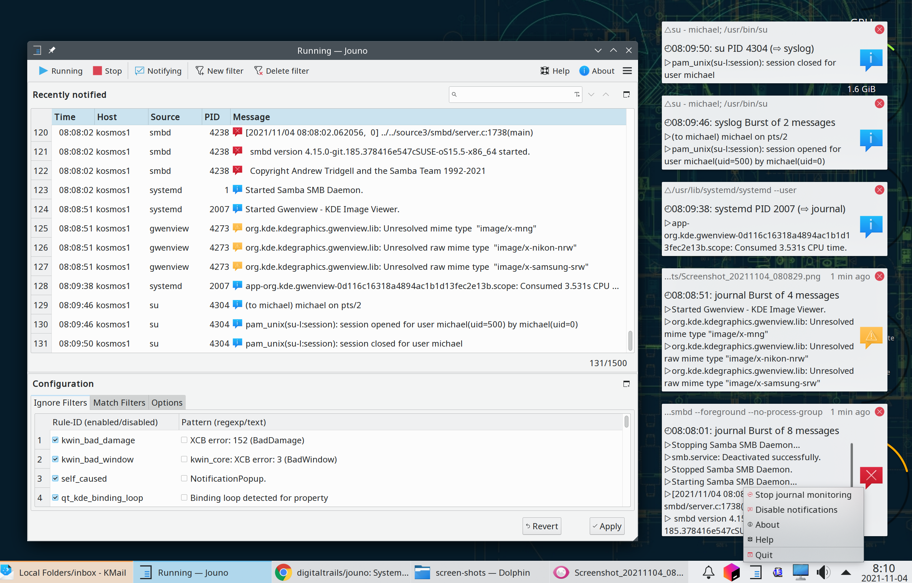
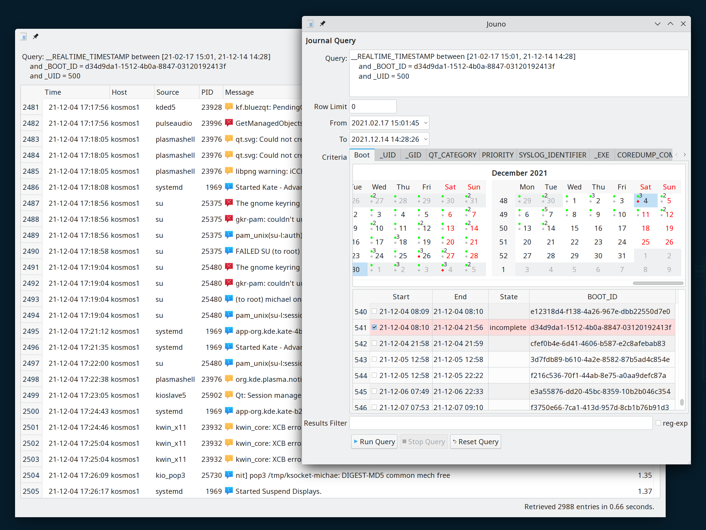

jouno: Journal notifications forwarder
======================================

A [Systemd-Journal](https://www.freedesktop.org/software/systemd/man/systemd-journald.service.html) viewer with 
[Freedesktop Notifications](https://specifications.freedesktop.org/notification-spec/latest/ar01s09.html) 
forwarding including burst-handling and filtering.

Description
-----------

 

 

``Jouno`` is a GUI *Systemd-Journal* monitoring and viewing tool.  Jouno can filter and bundle messages for
forwarding to the desktop as standard *DBUS Freedesktop Notifications* (most linux desktop environments present 
DBUS Notifications as popup messages). Jouno's feature set includes:

 * Journal live-view.
   + Overview table with live view incremental-search and select.
   + Double-click access to the all 50+ journal entry fields, including easy cut and paste.
   + Configurable history length, configurable full or filtered view.
 * Journal forwarding.
   + Forwarding of filtered messages to the desktop as DBUS-notifications.
   + Journal message-burst bundling to minimise desktop notifications.
   + Controls and options to enable/disable forwarding.
 * Filtering
   + Filtering to include or exclude messages.
   + Plain-text and regular-expression filtering.
   + Easy filter creation from any selected journal entry.
   + Filters may be edited, deleted, reordered, or selectively enabled or disabled.
   + Filter editing feedback via incremental-search of past journal entries as you edit.
   + Filters are saved to the config file and reloaded at startup.
 * Journal query interface
   + View/query current and past boots
   + Boot timeline calendar marked with boots, shutdowns, and shutdowns with incomplete journals (crashes).
   + Query refinement criteria including _BOOT_ID, _UID, _GID, QT_CATEGORY, SYSLOG_IDENTIFIER,
     _COM, _EXE, and _HOSTNAME (with helpful displays of values that actually occur in the journal).
   + Efficient queries using sd-journal API (via python systemd-journal)
 * User interface and configuration
   + Panels undock for maximised or customised viewing.
   + Customised panel and window geometries are saved across application-restart and panel-docking.
   + Dynamic (no restart) support for desktop theme changes, including light/dark theme switching.
   + An option to run minimised in the system-tray with a quick-access tray context-menu.
   + Full configuration UI, editing of config INI files is not required.
   + If Config INI files are externally edited, the changes are automatically reloaded without requiring a restart.

``jouno`` is a tool designed to improve awareness of background activity by monitoring
the journal and raising interesting journal-entries as desktop notifications.  Possibilities for 
it use include:

 * Monitoring specific jobs, such as the progress of the daily backups.
 * Watching for specific events, such as background core dumps.
 * Investigating desktop actions that raise journal log entries.
 * Discovering unnecessary daemon activity and unnecessary services.
 * Notifying access attempts, such as su, ssh, samba, or pam events.
 * Prevention of adverse desktop activity, such as shutting down during the backups.
 * Detecting hardware events. 
 * Providing timer and cron jobs with a simple way to raise desktop notifications.
 * Raising general awareness of what is going on in the background.


> I've also written a gist called [notify-desktop](https://gist.github.com/digitaltrails/26aad3282d8739db1de8bc2e59c812eb).
> I use ``notify-desktop`` in root-owned timer-jobs so the jobs can raise notifications with 
> the current desktop user.   While ``notify-desktop`` helps keep me informed about the
> status of jobs I've written, ``jouno`` allows me to watch for and monitor all journaled 
> activities.  My own jobs might now use more standard logging tools such as ``logger`` 
> and ``systemd-cat`` and rely on ``jouno`` to raise any desktop notifications.


Getting Started
---------------


To get started with ``jouno``, you only need to download the ``jouno.py`` python script and
check that the dependencies described below are in place. 


Dependencies
------------

All the following runtime dependencies are likely to be available pre-packaged on any modern Linux distribution 
(``jouno`` was originally developed on OpenSUSE Tumbleweed).

* python 3.8: ``jouno`` is written in python and may depend on some features present only in 3.8 onward.
* python 3.8 QtPy: the python GUI library used by ``jouno``.
* python 3.8 systemd: python module for native access to the systemd facilities.
* python 3.8 dbus: python module for dbus used for issuing notifications
* Freedesktop theme icons: these are normally installed by default on any Linux desktop.
  The application may look different under different desktop themes. It was developed on a 
  system that is set to the OpenSUSE Tumbleweed default theme. 

Dependency installation on ``OpenSUSE``::

        zypper install python38-QtPy python38-systemd python38-dbus-python

Installing
----------

As previously stated, the ``jouno.py`` script is only file required beyond the prerequisites. There
are also **OpenSUSE** and **Fedora** rpm's available at: [https://software.opensuse.org/package/jouno](https://software.opensuse.org/package/jouno)


The current options for installation are the following:

1. The script can be run without installation by using a python interpreter, for example:
   ```
   % python3 jouno.py
   ```
2. The script can be self installed as desktop application in the current user's desktop menu 
   as *Applications->System->jouno* by running:
   ```
    % python3 jouno.py --install
   ```
   Depending on which desktop you're running menu changes may require logout before they become visible.

3. A system-wide installation, download the RPM from the above link, then use rpm to install it:
   ```
   sudo rpm --install jouno-1.0.3-3.1.noarch.rpm
   ```
   The rpm will install the following files:
   ```
    /usr/bin/jouno
    /usr/share/applications/jouno.desktop
    /usr/share/icons/jouno.png
    /usr/share/licenses/jouno
    /usr/share/licenses/jouno/LICENSE.md
   ```


Executing the program
---------------------

* If installed by the current user via the ``--install`` option, ``jouno`` should be in
  the current user's application menu under **System**. The ``jouno`` command will be in ``$HOME/bin``.
  If ``$HOME/bin`` is on the user's ``PATH``, ``jouno`` will be able to be run from the command
  line:
  ```
  % jouno
  ```
* If the script has not been installed, it can still be run on the command line via the python interpreter, 
  for example:
  ```
  % python3 jouno.py
  ```

Help
----

Detailed help can be accessed by using the right mouse-button to bring up a context-menu or --help on the 
command line.  Access to the context-menu is available via a right-mouse click in both the application-window 
and the system-tray icon.

Accessories
-----------

A suggested accessory is [KDE Connect](https://kdeconnect.kde.org/).  If you enabled the appropriate permissions on 
your phone, KDE Connect can forward desktop notifications to the phone.  Use Jouno to forward Systemd-Journal 
messages to Desktop-Notifications, and use KDE Connect to forward them to your phone.


Issues
------

KDE kwin-compositing has an ongoing CPU/responsiveness issue for notifications that are set to expire ([bug 436240](https://bugs.kde.org/show_bug.cgi?id=436240)).
If this proves to be a problem, the ``jouno`` option notification_seconds can be set to zero, in 
which case popup messages won't expire and will remain visible until dismissed.  

Development
-----------

At this time there is only one real source file, ``jouno.py``

My IDE for this project is [PyCharm Community Edition](https://www.jetbrains.com/pycharm/).

My development Linux desktop is [OpenSUSE Tumbleweed](https://get.opensuse.org/tumbleweed/). The python3
interpreter and python3 libraries are from the standard OpenSUSE Tumbleweed repositories (Tumbleweed currently
defaults python3 to [python 3.8](https://www.python.org/downloads/release/python-380/)).

Authors
-------

Michael Hamilton\
``m i c h a e l   @  a c t r i x   .   g e n  . n z``


Version History
---------------

``jouno`` is currently still in development. It is feature complete and quite functional, but no formal release 
has been made.


License
-------

This project is licensed under the **GNU General Public License Version 3** - see the [LICENSE.md](LICENSE.md) file 
for details

**jouno Copyright (C) 2021 Michael Hamilton**

This program is free software: you can redistribute it and/or modify it
under the terms of the GNU General Public License as published by the
Free Software Foundation, version 3.

This program is distributed in the hope that it will be useful, but
WITHOUT ANY WARRANTY; without even the implied warranty of MERCHANTABILITY
or FITNESS FOR A PARTICULAR PURPOSE. See the GNU General Public License for
more details.

You should have received a copy of the GNU General Public License along
with this program. If not, see <https://www.gnu.org/licenses/>.

## Acknowledgments

* [pyqt](https://riverbankcomputing.com/software/pyqt/)
* [Systemd Journal](https://www.freedesktop.org/software/systemd/man/systemd-journald.service.html) 
* [Freedesktop Notifications](https://specifications.freedesktop.org/notification-spec/latest/ar01s09.html)
